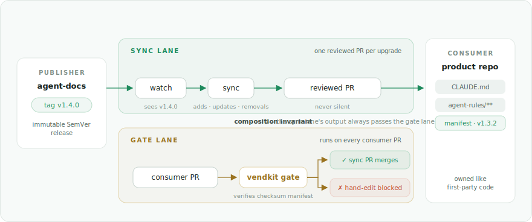

# VendKit

**Vendor curated slices of files across repos — with provenance, integrity gates, and governed upgrades.**

[](https://github.com/jameswbaxter/vendkit/actions/workflows/ci.yml)
[](https://github.com/jameswbaxter/vendkit/releases)
[](LICENSE)
[](https://pkg.go.dev/github.com/jameswbaxter/vendkit)

Some files have to be *identical* in every repo that uses them — agent
instructions, CI workflow templates, lint configs, design tokens. Copy-pasted,
they drift silently until the one repo nobody updated breaks. Locked behind a
package manager, they stop being plain files in your tree. VendKit vendors
them instead: source files in your tree, reviewed and greppable — **owned like
first-party code, kept faithful to upstream** by a checksum manifest.

## The two-lane model

A **publisher** repo declares which of its files form a distributable
**slice**. **Consumer** repos vendor a pinned copy, and two lanes keep that
copy honest:

<picture>
  <source media="(prefers-color-scheme: dark)" srcset="docs/two-lane-dark.svg">
  
</picture>

- **Sync lane** — watches the publisher for releases; each upgrade arrives as
  **one reviewed PR**. Adds, updates, removals — never silent.
- **Gate lane** — runs on **every consumer PR**; a hand-edit or delete of a
  vendored file cannot merge.
- **Composition invariant** — the sync lane's output always passes the gate
  lane. Upgrades flow; drift can't.

## Quickstart

One static Go binary, scaffolds embedded:

```sh
go install github.com/jameswbaxter/vendkit/cmd/vendkit@latest
```

### Publish a slice

In the repo that owns the canonical files, `vendkit-export.yml` declares
what's distributable:

```yaml
schema_version: 1
slice:
  name: agent-docs
  title: "Agent instructions"
publisher:
  scm: github               # github | azure-repos
  repo: your-org/agent-docs
include:
  - "CLAUDE.md"
  - "agent-rules/**/*.md"
```

Then cut a release — the tag *is* the release, and it's immutable:

```sh
vendkit generate              # writes the checksum manifest
vendkit release --bump minor  # tags the next minor, e.g. v1.4.0
```

### Onboard a consumer

From a checkout of the publisher at the release you're pinning:

```sh
vendkit init --ci github-actions --version v1.4.0
```

`--ci azure-pipelines` is a peer, not a port — same machinery, same
guarantees. `--ci none` scaffolds no pipelines at all; you run the same
commands by hand or on cron.

One command vendors the slice, writes the manifest, and scaffolds the sync,
gate, and watch pipelines. It ends with a short checklist of the few things it
can't do for you (credentials, branch protection) — `vendkit conformance`
tells you when you're fully wired.

### Then the machinery takes over

- Next publisher release: an upgrade PR appears in your repo. Review, merge,
  done.
- Someone hand-edits a vendored file: the gate fails their PR with the exact
  finding.
- Curious where you stand? `vendkit status` — pinned vs latest, drift
  findings, per slice. `vendkit update` upgrades in your working tree if
  you'd rather drive.

## What people vendor with it

**AI instructions across a fleet.** One canonical set of agent instructions —
`CLAUDE.md`, agent rules, prompt libraries, coding-standard docs, MCP config —
vendored into dozens of product repos. Every repo pins a release, hand-edits
can't merge, and the next revision of your instructions lands everywhere as a
reviewed PR instead of as forty stale copies.

- **Shared CI/pipeline templates** — golden GitHub Actions and Azure
  Pipelines workflows, upgraded by PR rather than by hope.
- **Org-wide config & policy** — linter configs, `.editorconfig`, security
  policies, license headers, byte-faithful across the fleet.
- **Design-system tokens & schemas** — source-of-truth files that must stay
  byte-identical downstream, reviewed like first-party code.

## Why not…

| Instead of | What it actually is | Why it's not this job |
|---|---|---|
| A package manager | Distributes built artifacts into opaque stores | VendKit puts source files in your tree — reviewed, greppable, owned like first-party code, kept faithful to upstream by a checksum manifest |
| git submodule / subtree | Pins whole repositories | Not curated slices; no drift gate, no per-file provenance, no migration lifecycle |
| Copybara | Continuous code-motion across a repo boundary | VendKit is release-oriented — immutable SemVer tags, migration payloads — and the consumer controls every change via PR |
| Renovate / Dependabot | Update dependency manifests | They don't vendor file trees or carry migrations |

## How it holds together

VendKit is built so you don't have to take its word for anything:

- A **checksum manifest** records exactly what was vendored, from which
  release and commit; the gate verifies against it.
- Releases that reshape content carry **migration payloads**, and migrations
  are **verified deterministically** — same inputs, same verdict.
- **Conformance checks** tell a consumer whether it's correctly wired,
  against rules the publisher ships with each release.
- The core engine is **vendor-service-free** — git and the filesystem only —
  and the consumer-side integrity path is **dependency-free**, Go stdlib
  only.
- It's **self-hosting**: this repository vendors its own slice and
  freshness-checks its own manifest in CI.

## Where next

| | |
|---|---|
| [docs/architecture.md](docs/architecture.md) | How the pieces fit together |
| [docs/specs/export-declaration.md](docs/specs/export-declaration.md) | Publisher side: declaring a slice |
| [docs/specs/onboarding.md](docs/specs/onboarding.md) | Consumer side: `init` and the slice config |
| [docs/specs/migrations.md](docs/specs/migrations.md) | Authoring and verifying migrations |
| [docs/specs/platform-integration.md](docs/specs/platform-integration.md) | CI setup: GitHub Actions & Azure Pipelines |
| [docs/specs/cli.md](docs/specs/cli.md) | The full `vendkit` CLI |
| [GLOSSARY.md](GLOSSARY.md) | Precise terms |

## License

[Apache-2.0](LICENSE)
