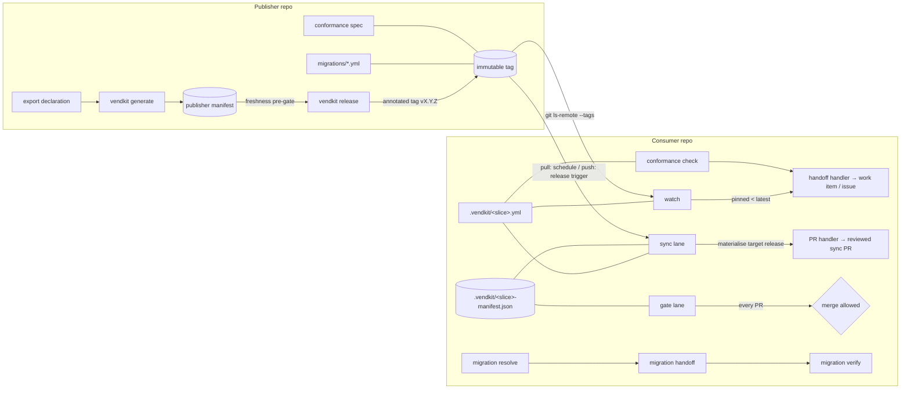

# Architecture

## 1. Layering

```
Layer 3  Adoption surface      scaffolder (init), conformance rule specs,
                               operator documentation
Layer 2  Platform integration  ADO step templates / GHA composite actions +
                               reusable workflows — thin, parameters-only
Layer 1  Platform adaptation   CI output surface (in-process dialects) +
                               handler executables (vendor services: PR,
                               work items, fact verification) behind the
                               exec handler protocol
Layer 0  Core engine           declaration parsing, manifest, materialise,
                               gate verification, version compare, migrations,
                               conformance evaluation, git-protocol upstream
                               reads  (pure Python; git + filesystem only)
```

Rules that keep the layers honest:

- **Layer 0 calls no vendor service** — its externals are git, the
  filesystem, and handler subprocesses; it never inspects CI environment
  variables except through `ci.detect()`. Its outputs are neutral: exit
  codes, `key=value` lines on stdout, JSON documents.
- **Layer 1 is the only place vendor knowledge appears, split by the
  format-vs-service rule (DR-0015):** in-process code may understand vendor
  *formats* (output dialects, pipeline YAML, CODEOWNERS syntax); vendor
  *services* live exclusively in handler executables behind the handler
  protocol (DR-0014).
- **Layer 2 contains no logic.** A template/action validates parameters,
  calls the CLI, and maps neutral outputs to platform outputs via the CI
  surface. If a template needs an `if`, the condition belongs in Layer 0
  or 1.
- **Layer 3 is data plus rendering.** The scaffolder renders CI-keyed
  template sets; conformance rules are YAML evaluated by the Layer 0 engine.

See [specs/platform-integration.md](specs/platform-integration.md) for the
CI surface and credential model, [specs/handler-protocol.md](specs/handler-protocol.md)
for the delivery boundary, and DR-0007/DR-0014 for why the boundary sits
exactly here.

## 2. Components and data flow



Component inventory, each with its own spec:

| Component | Layer | Spec |
|---|---|---|
| Export declaration | 0 (schema) | [specs/export-declaration.md](specs/export-declaration.md) |
| Manifest + gate lane | 0 | [specs/manifest-and-gate.md](specs/manifest-and-gate.md) |
| Materialise / sync lane | 0 (+1 PR handler) | [specs/sync.md](specs/sync.md) |
| Release cutter | 0 | [specs/releases-and-versioning.md](specs/releases-and-versioning.md) |
| Release watch | 0 (+1 handoff handler) | [specs/release-watch.md](specs/release-watch.md) |
| Migrations | 0 (+1 handoff handler) | [specs/migrations.md](specs/migrations.md) |
| Conformance | 0 (formats only) | [specs/conformance.md](specs/conformance.md) |
| Handler protocol + reference handlers | 1 | [specs/handler-protocol.md](specs/handler-protocol.md) |
| CI surface, credentials, differences ledger | 1 | [specs/platform-integration.md](specs/platform-integration.md) |
| Templates / actions | 2 | [specs/platform-integration.md](specs/platform-integration.md) §5 |
| Scaffolder + consumer config | 3 | [specs/onboarding.md](specs/onboarding.md) |
| CLI | 0 surface | [specs/cli.md](specs/cli.md) |

## 3. The invariants

Numbered; other specs cite them as INV-n. The conformance kit
([testing.md](testing.md)) turns each into an executable check.

- **INV-1 (Composition).** For any release, declaration, profile and consumer
  tree: `sync apply` produces a tree and manifest that pass `gate verify
  --strict` with zero findings.
- **INV-2 (Purity).** `materialise` output is a pure function of
  (release tree, export declaration, consumer profile, current consumer
  manifest). No clock, no network, no environment dependence.
- **INV-3 (Prediction).** `sync check` reports exactly what `sync apply` would
  write. A successful check always exits 0 and prints `changed=true|false`; any
  non-zero exit is an infrastructure failure — a crash can never masquerade as
  staleness (the *porcelain contract*).
- **INV-4 (Refresh by default).** Without explicit scope reconciliation, sync
  refreshes the currently tracked file set only. Scope changes (additions via
  reconcile, removals detected upstream) are always surfaced in a reviewed PR;
  files are **never deleted from disk automatically**.
- **INV-5 (Immutability).** A released tag is never moved or reused. A fix is a
  strictly newer release. Consumers additionally record the resolved commit SHA
  so tag substitution is detectable (see security model).
- **INV-6 (Engine-version).** Materialise always runs the *target* release's
  engine (the pinned platform reference resolves the same tree that supplies
  both content and engine). Gate verification always runs against the *pinned*
  release's manifest. There is no version skew inside either operation.
  *Forward note:* when the compiled engine ships, this restates as an
  explicit engine pin with schema-competence gating — see DR-0016. The
  human-tier CLI documents its own relaxation (cli spec).
- **INV-7 (Disjointness).** Across all slices vendored by one consumer, the
  `consumer_path` sets are pairwise disjoint. Checked by the gate lane on every
  PR.
- **INV-8 (Neutral core).** Layer 0 behaves identically on every platform and
  in no-CI (local/dev) execution — it calls no vendor service (DR-0014).
  Platform behaviour differences are confined to Layer 1 (CI surface,
  handlers, dialect parsing) and are enumerated in the platform-integration
  spec's differences ledger.
- **INV-9 (Dependency-free gate).** The consumer-side gate path runs on a stock
  Python standard library — no third-party packages, no YAML parsing (the gate
  reads only the JSON manifest).
- **INV-10 (Review sovereignty).** No machinery ever merges, pushes to a
  protected branch, or mutates consumer-owned content directly. Every change
  lands as a PR under the consumer's normal review rules.

## 4. Repository layout

```
vendkit/
  vendkit/                  # Layer 0+1 Python package
    core/                   #   engine: declaration, manifest, materialise,
    │                       #   verify, versions, migrations, conformance,
    │                       #   upstream (git-protocol reads), handlers
    │                       #   (invocation side of the handler protocol)
    handlers/               #   reference handler executables (Layer 1):
      github.py             #     GitHub PR/issue/fact delivery
      ado.py                #     Azure DevOps PR/work-item/fact delivery
      journal.py            #     neutral journal (tests, local runs)
    ci.py                   #   CI output surface — the one in-process
    │                       #   platform adaptation (DR-0014)
    cli.py                  #   single entrypoint `vendkit`
  platforms/                # Layer 2 wrapper packaging (DEFERRED, see roadmap):
    azure-pipelines/templates/*.yml       # the scaffolded consumer pipelines
    github-actions/actions/*/action.yml   # currently invoke the CLI directly
    github-actions/workflows/*.yml        # from the pinned publisher checkout —
                            #   same guarantees, fewer moving parts
  scaffold/
    azure-pipelines/*.tmpl  # Layer 3: consumer pipeline scaffolds (ADO)
    github-actions/*.tmpl   # Layer 3: consumer pipeline scaffolds (GHA)
                            #   (ci: none scaffolds no pipelines at all)
  conformance/
    core-rules.yml          # platform-neutral wiring rules shipped by default
  migrations/               # this repo's own migration payloads (self-hosted)
  vendkit-export.yml        # this repo's own export declaration (self-hosted)
  docs/                     # this spec set, maintained as the docs of record
```

**Self-hosting.** The framework repository is its own first publisher: it
exports the engine, handlers, templates and scaffolder as a slice, cuts releases
with its own release command, and gates itself with its own gate lane. Downstream
publishers vendor the machinery slice and layer their own content slices on top
(tier chain). Bootstrap is unproblematic: the release freshness pre-gate needs
only the working tree.

## 5. Multi-slice consumers

A consumer vendoring N slices holds, per slice: one manifest
(`.vendkit/<slice>-manifest.json`), one config (`.vendkit/<slice>.yml`), one sync
pipeline, and a pin inside that pipeline. It holds **one** gate-lane pipeline
total: the gate discovers every `.vendkit/*-manifest.json`, verifies each, and
enforces INV-7 across them. Watch is likewise a single pipeline reading every
slice config. Sync pipelines stay per-slice because cadence, credentials and
push triggers are per-publisher decisions.
