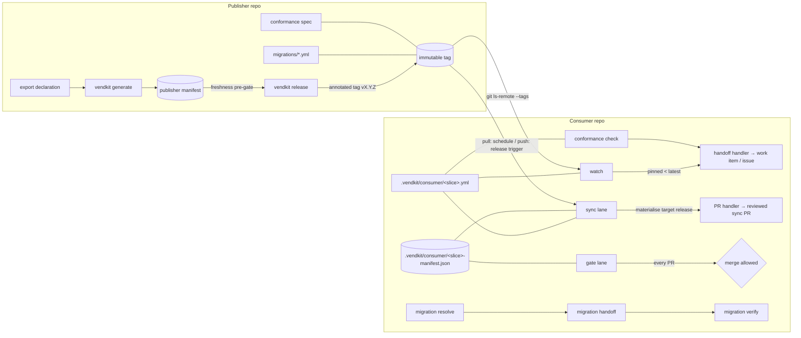

# Architecture

## 1. Layering

```
Layer 3  Adoption surface      scaffolder (init), conformance rule specs,
                               operator documentation
Layer 2  Platform integration  ADO step templates / GHA composite actions +
                               reusable workflows — thin, parameters-only
Layer 1  Platform adaptation   CI output surface (in-process dialects) +
                               handler executables (vendor services: PR,
                               work items, fact verification) behind the
                               exec handler protocol
Layer 0  Core engine           declaration parsing, manifest, materialise,
                               gate verification, version compare, migrations,
                               conformance evaluation, git-protocol upstream
                               reads  (one static Go binary; git + filesystem only)
```

Rules that keep the layers honest:

- **Layer 0 calls no vendor service** — its externals are git, the
  filesystem, and handler subprocesses; it never inspects CI environment
  variables except through `ci.detect()`. Its outputs are neutral: exit
  codes, `key=value` lines on stdout, JSON documents.
- **Layer 1 is the only place vendor knowledge appears, split by the
  format-vs-service rule (DR-0015):** in-process code may understand vendor
  *formats* (output dialects, pipeline YAML, CODEOWNERS syntax); vendor
  *services* live exclusively in handler executables behind the handler
  protocol (DR-0014).
- **Layer 2 contains no logic.** A template/action validates parameters,
  calls the CLI, and maps neutral outputs to platform outputs via the CI
  surface. If a template needs an `if`, the condition belongs in Layer 0
  or 1.
- **Layer 3 is data plus rendering.** The scaffolder renders CI-keyed
  template sets; conformance rules are YAML evaluated by the Layer 0 engine.

See [specs/platform-integration.md](specs/platform-integration.md) for the
CI surface and credential model, [specs/handler-protocol.md](specs/handler-protocol.md)
for the delivery boundary, and DR-0007/DR-0014 for why the boundary sits
exactly here.

## 2. Components and data flow


```mermaid
flowchart LR
  subgraph Publisher repo
    D[export declaration] --> G[vendkit generate]
    G --> M[(publisher manifest)]
    R[vendkit release] -->|annotated tag vX.Y.Z| T[(immutable tag)]
    M -->|freshness pre-gate| R
    MIG[migrations/*.yml] --- T
    CS[conformance spec] --- T
  end

  subgraph Consumer repo
    W[watch] -->|pinned < latest| H[handoff handler → work item / issue]
    S[sync lane] -->|materialise target release| PR[PR handler → reviewed sync PR]
    GATE[gate lane] -->|every PR| OK{merge allowed}
    MR[migration resolve] --> H2[migration handoff] --> V[migration verify]
    C[conformance check] --> H
    CFG[.vendkit/consumer/&lt;slice&gt;.yml] --- W & S & C
    CM[(.vendkit/consumer/&lt;slice&gt;-manifest.json)] --- GATE & S
  end

  T -->|pull: schedule / push: release trigger| S
  T -->|git ls-remote --tags| W
```

Component inventory, each with its own spec:

| Component | Layer | Spec |
|---|---|---|
| Export declaration | 0 (schema) | [specs/export-declaration.md](specs/export-declaration.md) |
| Manifest + gate lane | 0 | [specs/manifest-and-gate.md](specs/manifest-and-gate.md) |
| Materialise / sync lane | 0 (+1 PR handler) | [specs/sync.md](specs/sync.md) |
| Release cutter | 0 | [specs/releases-and-versioning.md](specs/releases-and-versioning.md) |
| Release watch | 0 (+1 handoff handler) | [specs/release-watch.md](specs/release-watch.md) |
| Migrations | 0 (+1 handoff handler) | [specs/migrations.md](specs/migrations.md) |
| Conformance | 0 (formats only) | [specs/conformance.md](specs/conformance.md) |
| Handler protocol + reference handlers | 1 | [specs/handler-protocol.md](specs/handler-protocol.md) |
| CI surface, credentials, differences ledger | 1 | [specs/platform-integration.md](specs/platform-integration.md) |
| Templates / actions | 2 | [specs/platform-integration.md](specs/platform-integration.md) §5 |
| Scaffolder + consumer config | 3 | [specs/onboarding.md](specs/onboarding.md) |
| CLI | 0 surface | [specs/cli.md](specs/cli.md) |

## 3. The invariants

The ten invariants are the properties every release, lane and consumer tree
satisfies. They are a governed standard of their own and live at
[standards/invariants.md](standards/invariants.md), which states each `INV-n`
and where it is held. Other documents cite them by number; this section is the
pointer, so a reader arriving from "architecture §3" lands on the numbers.

## 4. Repository layout

```
vendkit/                    # one Go module, one static binary (DR-0017)
  cmd/vendkit/              # single entrypoint `vendkit` + subcommand dispatch:
    main.go                 #   dispatch, flag plumbing, exit-code conventions
    cmds.go / human.go      #   CI-tier and human-tier commands
    handler.go              #   Layer 1: `vendkit handler <scm>` reference
    │                       #   PR/handoff/fact delivery (github, ado)
    selfverify.go           #   `vendkit self-verify` engine-pin check (DR-0016)
  internal/core/            # Layer 0 engine: declaration, manifest, materialise,
    │                       #   verify, versions, migrations, conformance,
    │                       #   upstream (git-protocol reads), handler invocation
  internal/ci/              # Layer 1 CI output surface — in-process dialects
  internal/e2e/             # Go unit + end-to-end scenario kit; journalhandler
    │                       #   is the neutral reference handler for tests
  assets.go                 # embeds scaffold/ + conformance rules into the binary
  scaffold/
    azure-pipelines/*.tmpl  # Layer 3: consumer pipeline scaffolds (ADO)
    github-actions/*.tmpl   # Layer 3: consumer pipeline scaffolds (GHA)
                            #   fetch + checksum-verify the pinned engine binary,
                            #   then run it (DR-0016); ci: none scaffolds none
  conformance/
    core-rules.yml          # platform-neutral wiring rules shipped by default
  .github/workflows/        # this repo's CI + SemVer release (checksummed
    │                       #   per-platform binaries + SHA256SUMS.txt, DR-0016)
  vendkit-export.yml        # this repo's own export declaration (self-hosted)
  vendkit-manifest.json     # generated + freshness-checked by the binary
  docs/                     # this spec set, maintained as the docs of record
```

Layer 2 wrapper packaging (`platforms/`) is deferred (see roadmap): the
scaffolded consumer pipelines invoke the pinned `vendkit` binary directly —
same guarantees, fewer moving parts.

**Self-hosting.** The framework repository is its own first publisher: it
exports its pipeline scaffolds and core conformance rules as a slice, cuts
releases with its own release command, and gates itself with its own gate lane.
The engine is not part of the slice — it reaches every tier as the pinned,
checksummed release artefact (DR-0016, DR-0020). Downstream publishers vendor
the machinery slice and layer their own content slices on top (tier chain).
Bootstrap is unproblematic: the release freshness pre-gate needs only the
working tree.

## 5. Multi-slice consumers

A consumer vendoring N slices holds, per slice: one manifest
(`.vendkit/consumer/<slice>-manifest.json`), one config (`.vendkit/consumer/<slice>.yml`), one sync
pipeline, and a pin inside that pipeline. It holds **one** gate-lane pipeline
total: the gate discovers every `.vendkit/consumer/*-manifest.json`, verifies each, and
enforces INV-7 across them. Watch is likewise a single pipeline reading every
slice config. Sync pipelines stay per-slice because cadence, credentials and
push triggers are per-publisher decisions.

## 6. The docs site

These docs are published as a *versioned* static site so a reader sees the docs
for the release they care about, not always `main`. The pipeline is pure Go —
no Python, Node, or mkdocs (DR-0017, DR-0018).

**Generator.** `internal/docsgen` is a build-time `package main` (never imported
by `cmd/vendkit`, so the shipped binary is unaffected). It renders the `docs/`
Markdown tree to self-contained HTML with [goldmark] (GFM tables included),
rewrites internal `*.md` links to the rendered `*.html` paths, and emits a left
nav plus a version-selector dropdown on every page.

Build the site locally:

```
# Render one version into ./dist (repeat per release; dist/ is gitignored).
go run ./internal/docsgen --docs docs --out dist --version v0.1.0
go run ./internal/docsgen --docs docs --out dist --version v0.2.0
# dist/v0.1.0/  dist/v0.2.0/  dist/latest/  dist/versions.json
```

`go run ./internal/docsgen --help` documents the flags.

**Versioning.** Each run writes `dist/<version>/` (one page per doc plus an
`index.html`), merges the version into `dist/versions.json` (newest first, the
newest marked `latest` by SemVer), and mirrors the newest version into
`dist/latest/`. Output is deterministic (stable ordering, no timestamps), so
re-running a version is idempotent and diffs are clean. The in-page selector
fetches `versions.json` at runtime, so a page published for an older release
still lists releases added later.

**Publishing.** `.github/workflows/pages.yml` accumulates on a `gh-pages`
branch: on a `vX.Y.Z` tag it seeds from the currently published site, renders
that version into it, and republishes the whole tree — previously published
versions stay put. A push to `main` re-overlays the hand-authored landing page
(`site/index.html`) at the site root. The landing page's "Docs" links point at
`/latest/`.

[goldmark]: https://github.com/yuin/goldmark
